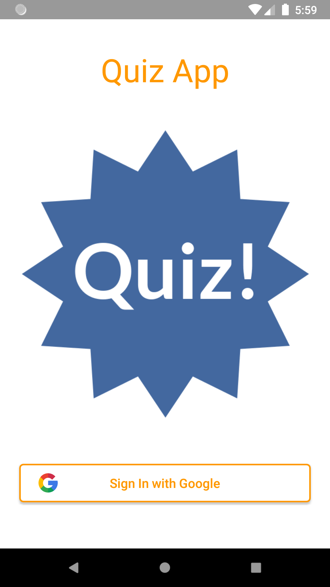
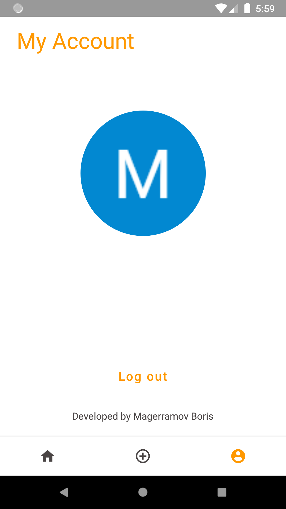
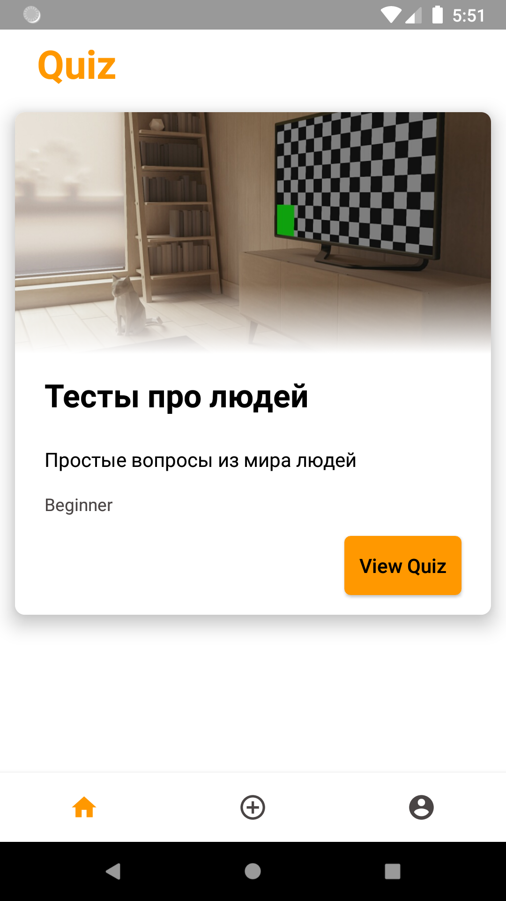
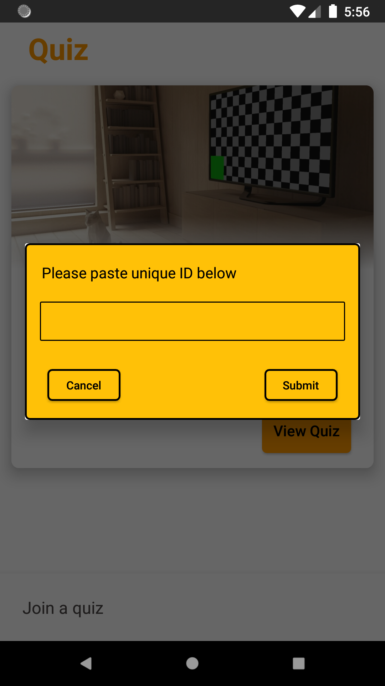
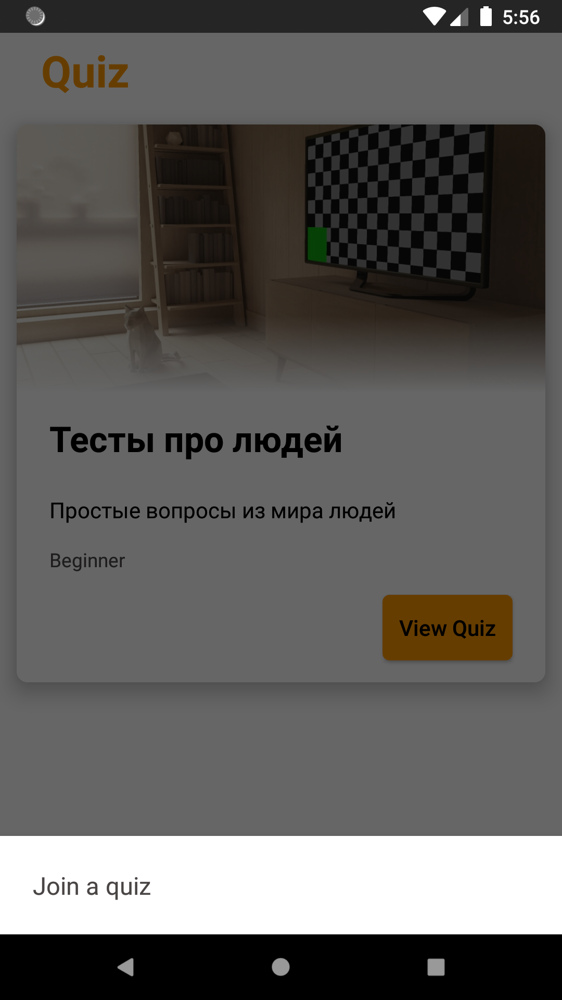
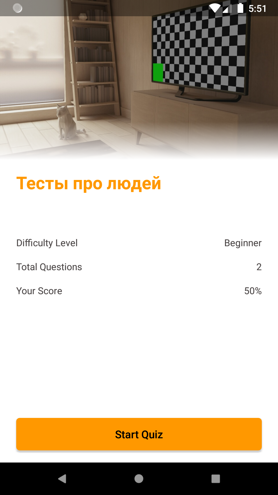
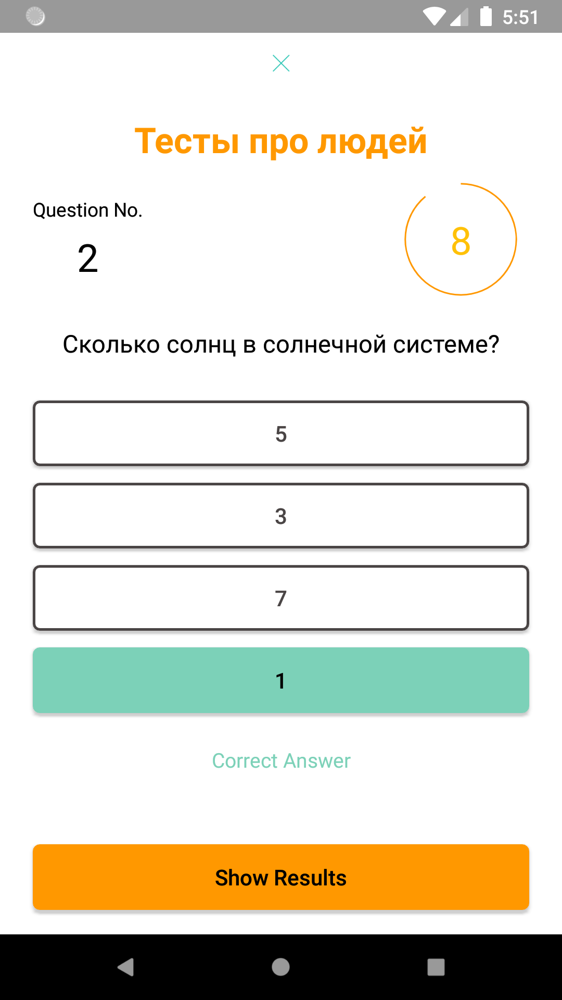
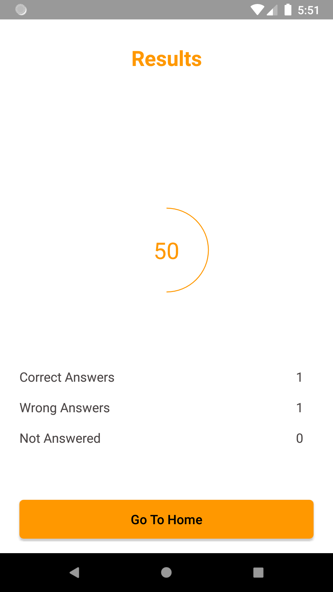

# Викторина

Приложение, в котором пользователь может создавать викторины, проходить викторины других участников, полученных при помощи добавления кода викторины.

## Коды для примера работы
xmFlQCO8ywnnCVKZgCC7

## Требования

Устройство с Google сервисами для авторизации в приложении.

## Функции реализованные для mvp-проекта
- Авторизация в системе, выход из системы;
- Прохождение теста;
- Таймер в вопросах;
- Формирование результата прохождения викторины;
- Навигация по приложению;
- Добавление викторины по полученному коду от другого участника.

## Функции для улучшения проекта
- Создание викторины в приложении;
- Создание вопроса в приложении;
- Загрузка картинки к викторине;
- Удалить викторину;
- Поделиться викториной;
- Реализация темной темы;
- Локализация.

## Скриншоты демонстрации работы приложения

| Авторизация в приложении | Аккаунт пользователя |
|---|---|
|  |  |

| Домашняя страница с доступными викторинами | Поле для ввода кода викторины |
|---|---|
|  |  |

| Меню для открытия поля добавления викторины | Детали викторины |
|---|---|
|  |  |

| Случай, когда дан верный ответ | Случай, когда дан неверный ответ  | Результаты  |
|---|---|---|
|  |  |  |

## Конифигурирование проекта
Для демонстрации работы приложения просто склонируйте репозиторий и запустите проект в Android Studio.

Если Вы хотите использовать приложение в своем проекте, то вам необходимо зарегистрировать приложение в Firebase, подключить аутентификацию Google, сгенерировать ключ и добавить его в поле при создании файла google-services.json.
Настройка Firebase Database представлена в директории /docs/firebase/screenshots.

## Автор

Магеррамов Борис, 2021-2022